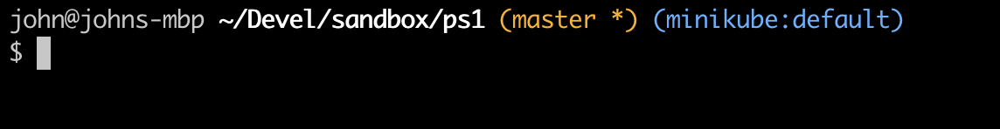

# Git Prompt

Stuff I hacked together to customize my bash prompt. Not of this is my work, most credits go to:

- [Shawn O. Pearce](https://github.com/spearce)  for [.git-prompt](https://github.com/git/git/blob/master/contrib/completion/git-prompt.sh) script.
- [Jon Mosco](https://github.com/jonmosco) for [kube-ps1](https://github.com/jonmosco/kube-ps1)

Works on my macOS machine ;)

## Installation

- Clone this repo
- Run `make install`
- Open a new terminal session or `source ~/.bash_profile`

## Example

## License

GPLv2 (see LICENSE)
